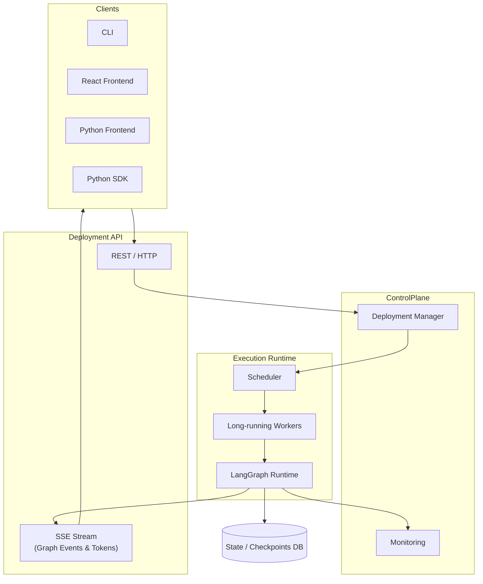

# lg-deploy

Open-source deployment runtime for LangGraph agents, built for scalable and production use.

## Architecture

[View detailed diagram](docs/diagrams/architecture.md)

## Documentation

See the [docs](docs/) folder for all documentation.

## Requirements

- Python 3.11.9

## Goals

- Provide a robust and scalable deployment runtime for LangGraph agents.
- Docker deployment support.
- Easy integration with existing LangGraph workflows.
- Plugins to connect to various frontends like react, streamlit etc.
- CLI support for managing deployments.

## Authors

- janardhanhere

## License

- Apache 2.0
