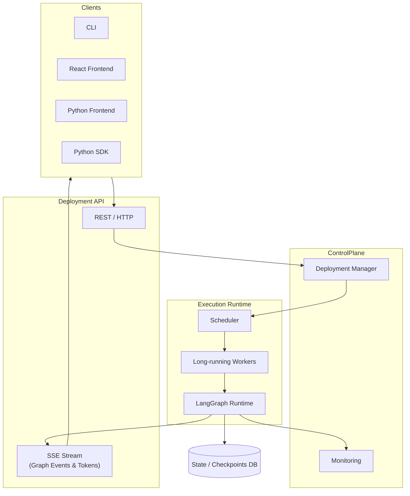

# Architecture Diagram

## Mermaid Source Code

## Related Documentation

- [High Level Design (HLD)](../architecture-hld.md)
- [Low Level Design (LLD)](../architecture-lld.md)
- [Software Requirements](../software-requirements.md)
- [System Requirements](../system-requirements.md)
- [Test Strategy](../test-strategy.md)

## Files

| File | Description |
|------|-------------|
| `lg-deploy.mmd` | Mermaid source code (version-controlled source of truth) |
